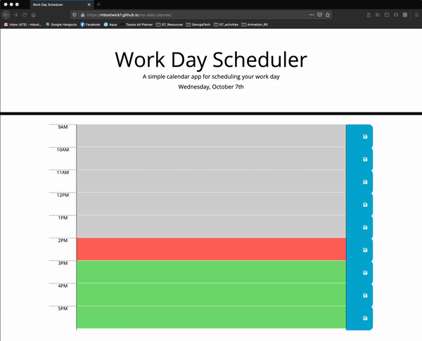

# my-daily-planner

## Table of Contents

* [Objective](#Objective)
* [Description](#Description)
* [Usage](#usage)
* [Credits](#credits)

 ## Objective
 
 - To build a workday daily planner with JQuery.
 
 ## Description
 
 [GitHub](https://github.com/mbostwick1/my-daily-planner)
 
 [Live URL](https://mbostwick1.github.io/my-daily-planner/)
 
 - This workday calendar allows the user to input their to-do list into the description area next to each hour and save the information. Each time block is color coded depending on the current hour to show past, present, and future.

 ## Usage

## Credits
[Bootstrap](https://getbootstrap.com/docs/4.5/components/)
[FontAwesome Icons](https://fontawesome.com/icons/save)
[Stack Overflow Forums](https://stackoverflow.com/)
[W3 Schools JS](https://www.w3schools.com/js/)
[MDN web docs](https://developer.mozilla.org/en-US/)

